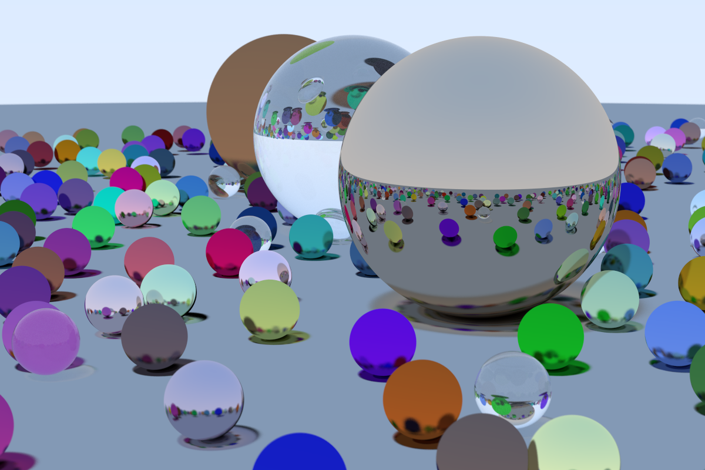

# Ray Tracing in One Weekend

Ray tracer created by following along with the tutorial from the [Ray Tracing in One Weekend ](https://raytracing.github.io/books/RayTracingInOneWeekend.html).

## Compiling

`g++ main.cpp -std=c++11 -O2`

## Usage

`./a.out > image.ppm`
